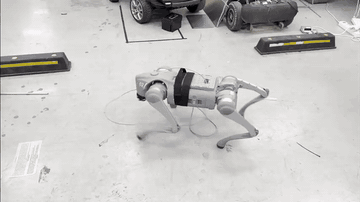

# Unitree Go2 Deploy Baseline for Isaac Lab

This repository contains an Isaac Lab external project for a Unitree Go2 velocity-tracking baseline.

The task keeps the real-deploy policy observation layout used by `deploy/deploy_real/go2_sim_to_real.py`:

```text
base angular velocity, projected gravity, velocity command,
joint position error, joint velocity, previous action, gait phase sin/cos
```

That gives a 47-dimensional policy observation and keeps the exported policy interface aligned with the low-level Go2 deploy runner.

## Demos

[](docs/media/demo_rotation.mp4)

[](docs/media/demo_outdoor_walk.mp4)

Full videos:

- [Indoor rotation MP4](docs/media/demo_rotation.mp4)
- [Outdoor walking MP4](docs/media/demo_outdoor_walk.mp4)

## Layout

- `source/go2_deploy_lab`: Isaac Lab extension and task registration
- `scripts/rsl_rl`: Isaac Lab RSL-RL train/play scripts with this extension imported
- `deploy/deploy_real`: low-level Go2 sim-to-real runner
- `docs/media`: demo videos and README previews

## Install

Use the Isaac Lab Python environment:

```bash
conda activate isaaclab
git clone https://github.com/iamjaehka13/unitree_go2_deploy_baseline_fullcode_lab.git
cd unitree_go2_deploy_baseline_fullcode_lab
python -m pip install -e source/go2_deploy_lab
```

If plain `python` cannot import Omniverse modules, run train/play through your Isaac Lab launcher:

```bash
conda activate isaaclab
cd unitree_go2_deploy_baseline_fullcode_lab
export ISAACLAB_ROOT=/path/to/IsaacLab
TERM=xterm-256color "${ISAACLAB_ROOT}/isaaclab.sh" -p scripts/rsl_rl/train.py \
  --task Isaac-Velocity-Flat-Unitree-Go2-Deploy-Baseline-v0 \
  --headless
```

## Tasks

Registered task IDs:

```text
Isaac-Velocity-Flat-Unitree-Go2-Deploy-Baseline-v0
Isaac-Velocity-Flat-Unitree-Go2-Deploy-Baseline-Play-v0
```

Train the flat deploy baseline:

```bash
export ISAACLAB_ROOT=/path/to/IsaacLab
TERM=xterm-256color "${ISAACLAB_ROOT}/isaaclab.sh" -p scripts/rsl_rl/train.py \
  --task Isaac-Velocity-Flat-Unitree-Go2-Deploy-Baseline-v0 \
  --headless
```

Play/export a checkpoint:

```bash
export ISAACLAB_ROOT=/path/to/IsaacLab
TERM=xterm-256color "${ISAACLAB_ROOT}/isaaclab.sh" -p scripts/rsl_rl/play.py \
  --task Isaac-Velocity-Flat-Unitree-Go2-Deploy-Baseline-Play-v0 \
  --checkpoint /path/to/model.pt
```

The Isaac Lab play script exports TorchScript and ONNX policies under the checkpoint run's `exported/` directory.

## Real Deploy

The training curriculum can sample a wider hard command range for robustness (`x: [-1.0, 2.0]`,
`y: [-1.0, 1.0]`). The real deploy runner keeps conservative default command limits
(`x: [-0.5, 1.0]`, `y: [-0.5, 0.5]`, `yaw: [-1.0, 1.0]`) for physical safety.

Pass the exported TorchScript policy explicitly:

```bash
python deploy/deploy_real/go2_sim_to_real.py enp3s0 \
  --policy /path/to/exported/policy.pt \
  --teleop keyboard
```

Keep an estop ready and use the deploy runner only when the robot is physically safe to initialize.
